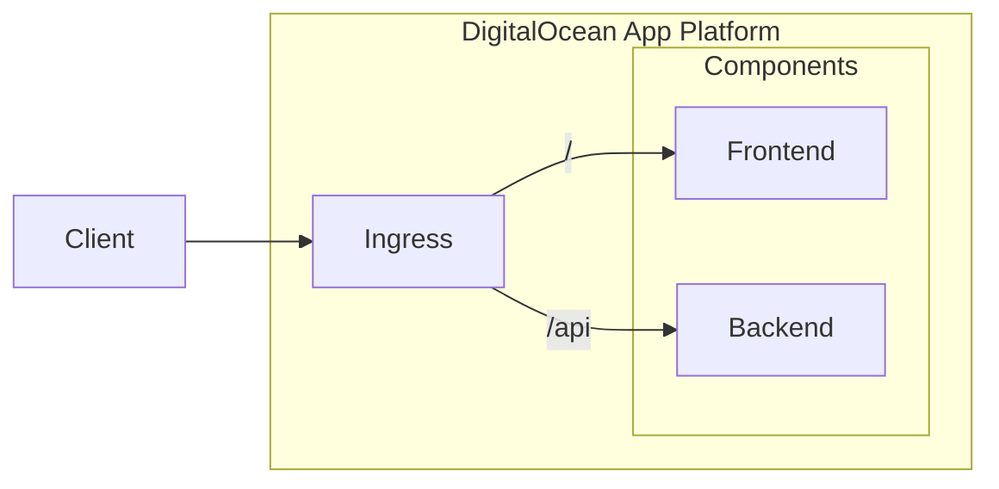

# Taskly

Taskly is an application that allows users to sign in and create tasks. It is
also used by [System Initiative](https://www.systeminit.com/) as an
[assessment](https://github.com/systeminit/assessment-ie3) for their
Infrastructure Engineer III role.

## Development

Taskly is split into two components, a `frontend` and a `backend`. These
components can be run locally using either Docker or npm, each of which support
hot-reloading for a fast development feedback cycle. For more information about
each component, refer to its `README.md` in its respective directory.

### Using Docker

Start both the frontend and backend.

```sh
make
```

Access Taskly using the following URLs.

- Frontend - http://localhost:3000
- Backend - http://localhost:3030

### Using npm

Open a separate terminal and run the frontend.

```sh
cd frontend && npm install && npm run dev
```

Open a separate terminal and run the backend.

```sh
cd backend && npm install && npm run dev
```

Access Taskly using the following URLs.

- Frontend - http://localhost:3000
- Backend - http://localhost:3030

## Deploying

On merge to `main` the `frontend` and `backend` components are linted, tested,
and their container images are built and pushed to Docker Hub. After the
container images are pushed to Docker Hub, Terraform is executed to deploy
Taskly to DigitalOcean App Platform.

The following directories contain the deployment code.

- GitHub Actions - `.github/workflows`
- Terraform Configuration - `infrastructure`

### Architecture

This is the architecture diagram for Taskly running on DigitalOcean App
Platform.


