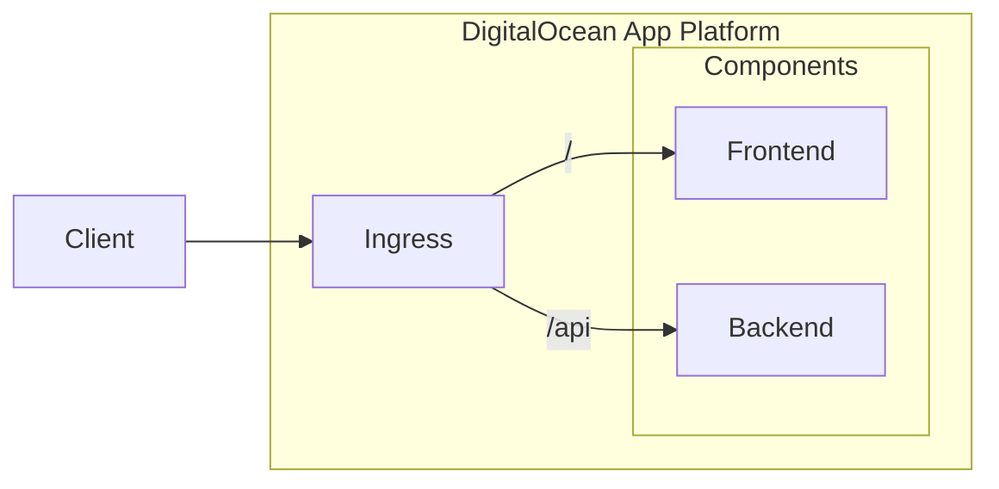

# Taskly

Taskly is an application that allows users to sign in and create tasks. It is
also used by [System Initiative](https://www.systeminit.com/) as an
[assessment](https://github.com/systeminit/assessment-ie3) for their
Infrastructure Engineer III role.

## Development

Taskly is split into two components, a `frontend` and a `backend`. These
components can be run locally using either Docker or npm, each of which support
hot-reloading for a fast development feedback cycle. For more information about
each component, refer to its `README.md` in its respective directory.

### Using Docker

Start both the frontend and backend.

```sh
make
```

Access Taskly using the following URLs.

- Frontend - http://localhost:3000
- Backend - http://localhost:3030

### Using npm

Open a separate terminal and run the frontend.

```sh
cd frontend && npm install && npm run dev
```

Open a separate terminal and run the backend.

```sh
cd backend && npm install && npm run dev
```

Access Taskly using the following URLs.

- Frontend - http://localhost:3000
- Backend - http://localhost:3030

## Deploying

On merge to `main` the `frontend` and `backend` components are linted, tested,
and their container images are built and pushed to Docker Hub. After the
container images are pushed to Docker Hub, Terraform is executed to deploy
Taskly to DigitalOcean App Platform.

The following directories contain the deployment code.

- GitHub Actions - `.github/workflows`
- Terraform Configuration - `infrastructure`

### Architecture

This is the architecture diagram for Taskly running on DigitalOcean App
Platform.



## Engineering

This section details the engineering that went into this assessment.

### Local Development

The first thing I did when starting this assessment is make sure I could run
Taskly locally. I read the `README.md` files for the `frontend` and `backend`
components and ran each component using `npm run dev`. Once I had Taskly up and
running I poked around the user interface and the API to get familiar with the
code and make sure both components worked well together.

Since the acceptance criteria for this assessment asked to build each component
as a container image and run these container images in the cloud I decided it
would be beneficial to create a local development environment using Compose. I
chose Compose because I have extensive experience with it. I also wrapped
Compose using a `Makefile` just for ease of development.

Goals:

- Build and run container images for each component.
- Support hot-reloading when running Taskly via Compose.
- Flush out any issues running Taskly outside the given `npm run dev` method.
- Model different deployment options for Taskly to influence production
  architecture.
- Tighten the feedback loop to enable rapid iteration during local development.

Pull Requests:

- https://github.com/sudomateo/assessment-ie3/pull/1

### GitHub Actions

Now that I had a local development environment I shifted focused to getting
CI/CD set up. I chose GitHub Actions because I was already familiar with GitHub
Actions and the assessment was a fork on GitHub. The assessment asked to lint
the code and run the tests. Since there were already existing hooks to do this
via npm, I decided to use npm in CI/CD. At this point I just wanted to get
feedback going for future pull requests (e.g. linting, testing, container image
building). I purposefully did not add a process for pushing container images at
this time to keep the scope small and focused.

Goals:

- Provide checks and feedback for code pushes and pull requests.
- Frontend CI/CD.
  - Lint the code.
  - Build the container.
- Backend CI/CD.
  - Lint the code.
  - Run the tests.
  - Build the container.
- Scan the container images using Trivy.

Pull Requests:

- https://github.com/sudomateo/assessment-ie3/pull/2

### Health API

I started to think more about what Taskly would look like when it's deployed to
production. I knew that no matter what deployment architecture I finalized on
that I would need the ability to determine whether the components were up and
healthy. For the frontend that's pretty simple since it would just be a
production `vite` build that's served as a static site. The backend would need
some API endpoint that could be hit to determine health. At first I figured I
would just use `/api/users` but that didn't sit well with me since in the
future that route would most likely result in a round trip to the database. So
I decided to spend some time creating a new `/api/health` endpoint that I could
use to determine whether the backend was up and healthy.

Goals:

- Develop a way to determine if the backend is healthy.

Pull Requests:

- https://github.com/sudomateo/assessment-ie3/pull/3

### Multi-Stage Container Images

At this point I had a pretty good idea of what the production deployment of
Taskly would look like. However, I did not have production container images
yet. The container images still contained the source code, development
dependencies, and did not have a `CMD` directive. I introduced multi-stage
container images so I could specify one target for development and another
target for production. This allowed me to keep all the development benefits
while really cleaning up those production images. I also decided it was time to
push these container images to a public registry. I chose Docker Hub since I
already had an account for it.

Goals:

- Remove bloat from container images (i.e. source code, development
  dependencies, etc.).
- Use the production builds for both containers.
- Decrease container size if possible.
- Push container images to a public registry.

Pull Requests:

- https://github.com/sudomateo/assessment-ie3/pull/5

### Documenation and Cleanup

I took a break from major development and took a step back to see if there were
places the code needed to be cleaned up or documentation needed to be added. I
ran `npm run format` to format the backend code. I didn't add formatting to the
CI/CD workflow since that would be something I'd rather discuss with the team
before picking my personal prettier rules and enforcing them via CI/CD. I also
realized I forgot to document the health API so I tackled that too.

Goals:

- See if the code needed any formatting.
- Add missing documentation for health API.

Pull Requests:

- https://github.com/sudomateo/assessment-ie3/pull/4
- https://github.com/sudomateo/assessment-ie3/pull/6

### Taskly Deployment

It was finally time to wrap up this assessment and get Taskly deployed to
production. I decided that I would deploy Taskly behind the same DNS hostname
because I wanted to serve the frontend via static files without using a reverse
proxy or making code changes to update the base URL for the API. At first I was
going to deploy Taskly on Kubernetes but then I decided to simplify things by
using DigitalOcean App Platform. I have experience with both Kubernetes and
DigitalOcean App Platform so I just chose the simpler of the two given the time
constraint.

At first I was not going to have Taskly automatically deploy on merge to `main`
but then I decided to go for it. Generally speaking I like to have a separate
deployment process that can be triggered outside of a merge to `main` but in
this case I figured deploying on merge to `main` would be fine. I wrote
Terraform configuration to deploy Taskly on DigitalOcean App Platform and
created a new CI/CD workflow to run this Terraform on merge to `main`. I stored
the Terraform state in a free Terraform Cloud workspace because it was the
quickest to get up and running and required minimal credentials.

Goals:

- The deployment must use the public production container images.
- The deployment must be publicly accessible.
- The deployment must be codified and automated.

Pull Requests:

- https://github.com/sudomateo/assessment-ie3/pull/7
